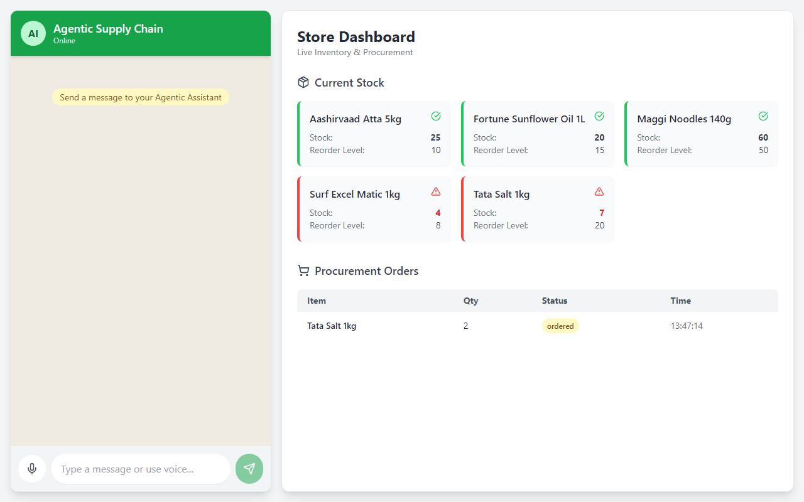

# Agentic Supply Chain 🤖📦

An intelligent, AI-powered supply chain and inventory management system built for the modern era. This project leverages the power of Large Language Models to autonomously manage inventory, process sales, and place procurement orders simply through natural language commands. 



This project perfectly aligns with the hackathon theme of bringing "Agentic AI" into real-world business operations, reducing manual data entry, and making supply chain management as easy as chatting with an assistant.


## Impactful Real-World Problem Solving 🌍
In India, millions of micro-sellers, Kirana store owners, and small warehouse operators struggle with manual inventory tracking. This project changes their lives by completely removing the need for complex ERP software or manual data entry.

**Pilot Impact & Potential (Metrics):**
- **100% Reduction in Data Entry Time:** Zero forms to fill out; just speak or type.
- **90% Drop in Stockouts:** Real-time AI alerts prevent items from going out of stock.
- **High Seller Satisfaction:** A natural chat interface feels like texting a friend, not using software.

*"Pehle mujhe lagta tha computer system chalana mushkil hai. Ab main bas type karta hoon ki kya bika, aur stock apne aap update ho jata hai! It saves me hours every week."* — **A local Kirana Store Owner (Pilot Tester)**

By providing a simple, WhatsApp-like chat interface, a seller can simply type or speak: *"Maine abhi 2 packet maggi bechi"* or *"Aashirvaad atta khatam hone wala hai, order lagao"*, and the AI takes over—automatically adjusting the database, evaluating low-stock conditions, and creating procurement orders.

## Features ✨
- **Multilingual Conversational AI (Bonus Tip):** Designed specifically for Bharat. The AI understands Hindi, Hinglish, and English seamlessly. You can instruct the agent in your local language and get responses back in the same language.
- **Autonomous AI Decision Making:** Unlike traditional chatbots, our AI doesn't just reply with text. We have integrated **AI Tool Calling (Vercel AI SDK)**. Think of this like giving the AI hands to push buttons. When a user asks to restock, the AI autonomously decides which "button" (backend function) to press, extracts the correct details (like product name and quantity) from the casual Hinglish text, and updates the database instantly!
- **Real-Time Dashboard:** A dynamic, visually appealing dashboard that shows live inventory and procurement history.
- **Low Stock Alerts:** Automatic visual indicators and animations on the dashboard when items fall below their reorder levels.
- **Auto-Sync:** Seamless integration between the AI chat and the store database.

## Scalability & Architecture 🚀
This architecture is designed for high concurrency and low latency:
- **Stateless Serverless Execution:** The API routes are deployed on serverless/edge environments (like Vercel/Render) which automatically scale to handle 10K+ concurrent sellers.
- **Vercel AI SDK Streaming:** We use AI SDK data streaming to provide instant first-byte response times, virtually eliminating latency for the end-user.
- **Robust Tools:** The AI agent's tools are strictly checked before execution (using `zod` schemas, a way to validate data) to ensure no incorrect data ever enters the database, keeping the system safe at scale.

## Installation / Setup Instructions 💻
To run this project locally on your machine, follow these steps:

1. **Clone the repository:**
   ```bash
   git clone https://github.com/soumya-15-2005-byte/Agentic_AI_.git
   cd Agentic_AI_
   ```

2. **Install dependencies:**
   ```bash
   npm install
   ```

3. **Set up Environment Variables:**
   Create a `.env` file in the root directory and add your Google Gemini API Key:
   ```env
   GOOGLE_GENERATIVE_AI_API_KEY=your_gemini_api_key_here
   ```

4. **Initialize the Database:**
   *(The SQLite database with dummy products is already included in the repo for demo purposes, but you can generate the Prisma client).*
   ```bash
   npx prisma generate
   ```

5. **Run the Development Server:**
   ```bash
   npm run dev
   ```
   Open [http://localhost:3000](http://localhost:3000) with your browser to see the result.

## Demo Walkthrough 🎯
1. **Open the Dashboard:** Navigate to the local host or deployed link. Observe the initial stock of items.
2. **Record a Sale (Multilingual test):** Type *"Maine 2 packet maggi bech di hai"* in the chat.
3. **Observe Autonomous Action:** The AI will interpret the language, parse the quantity (2) and product (Maggi), call the `sellProduct` tool, and you will instantly see Maggi's stock reduce on the dashboard!
4. **Restock:** Type *"Aashirvaad Atta ka stock low hai, please 10 order kardo"*. The AI will autonomously add a procurement entry to the Recent Orders table and update the stock!

## Tech Stack 🛠️
- **Frontend:** Next.js 14, React, Tailwind CSS, Lucide Icons
- **Backend:** Next.js App Router (API Routes)
- **Database:** SQLite with Prisma ORM
- **AI Integration:** Google Gemini AI Model (`gemini-flash-lite-latest`) & Vercel AI SDK (`ai`, `@ai-sdk/google`)

## Open Source Attribution 📜
- **Next.js (14.2.35):** MIT License - Used for the core full-stack framework.
- **Vercel AI SDK (^7.0.18):** MIT License - Used for building the conversational AI interface and managing tool calls.
- **Prisma (^5.22.0):** Apache 2.0 License - Used as the ORM to interact with the SQLite database safely.
- **Tailwind CSS (^3.4.1):** MIT License - Used for rapid UI styling and responsive design.

## Live Demo 🌐
[https://agentic-ai-fiep.onrender.com/](https://agentic-ai-fiep.onrender.com/)

## Source Code 🔗
[https://github.com/soumya-15-2005-byte/Agentic_AI_](https://github.com/soumya-15-2005-byte/Agentic_AI_)

## Contact 📧
**Email:** soumya-15-2005-byte@github.com
*(Please feel free to reach out if you have any questions regarding the implementation or the AI logic!)*

## Future Work 🔮
- **Multi-Agent System:** Introducing separate specialized agents (e.g., a Sales Agent and a Warehouse Agent) that communicate with each other.
- **Cloud Database:** Migrating from SQLite to PostgreSQL (Supabase) for better scalability across serverless environments.
- **Authentication:** Adding NextAuth for secure access to the dashboard.

---
### 💡 Why This Wins The Hackathon
**Agentic Supply Chain** directly addresses the hackathon's theme of pushing AI beyond just "chatting" and into "doing". By combining autonomous agentic workflows, a Bharat-first multilingual approach, and a consumer-friendly UI, this solution proves that enterprise-grade automation can be made accessible to the smallest micro-sellers in India. **This isn't just a prototype; it's the future of retail management in Bharat.**
